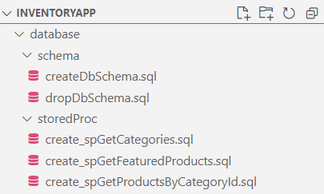
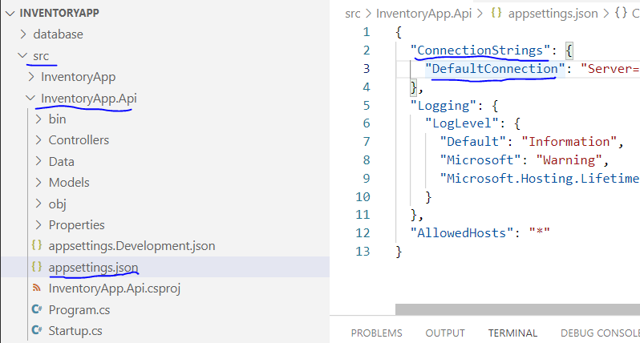

# Running this locally using .Net CLI and VS Code

> The current project is developed using 5.0 version of .Net Core SDK. Install latest .Net Core SDK (if not available) from [here](https://dotnet.microsoft.com/download).

> Run the scripts to create DB - Create Schema and Create Store Procs
> 
> 

> Change Connection string in appsettings.json in API project:
> 
> 

> Run the API first on this location:
>
> 

> Run the Console App next on this location:
>
> 

> To Run unit tests follow the below command in the mentioned location:
>
> 
